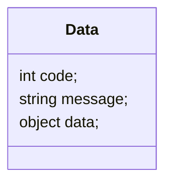
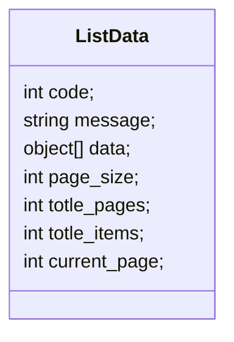

# 接口定义

所有接口采用通用前缀 `/api/`, 特殊接口除外, 响应结构固定情况为下面两种

:::tip

`code` 字段为状态码, 200 为正常响应, 其他为错误响应.

`message` 字段一般为错误信息.

后续接口文档中将省略最外层的 `code`, `message` 字段, 仅展示 `data` 字段的结构.

部分接口的响应接口可能不为下面两种格式, 会在文档中特别说明.

:::

- 单体数据响应

- 列表数据响应

## 接口分类

通常接口按照功能, 通过不同路径进行分类, 例如 `/api/public` 为公开接口等.

接口通常只允许特定类型的请求, 例如: 接受 `GET` 请求的接口不接受其他类型的请求.

