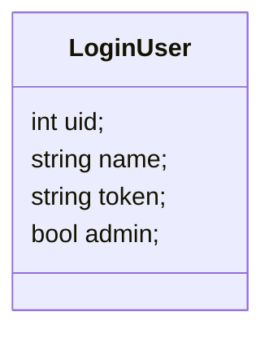

# 登陆接口

## 接口路径

`/api/user/login`

## 请求参数

url参数:

- `code` : 通过 osu 登陆后, 回调的获得的 code

## 响应结果

响应结果为单体数据, data定义为:

```mermaid
classDiagram
class LoginUser {
    int uid;
    string name;
    string token;
    bool admin;
}
```
