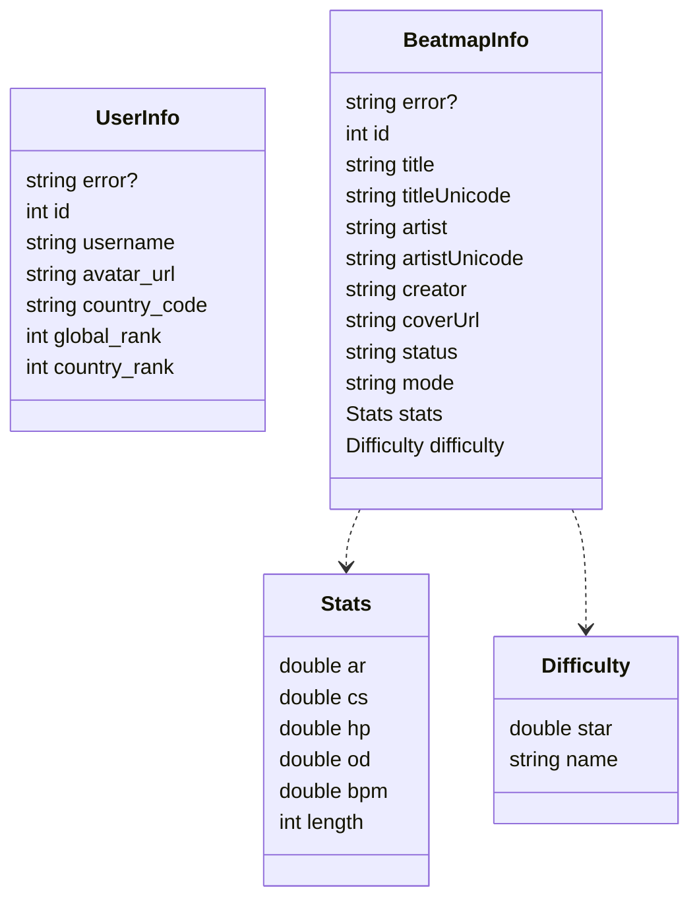

:::warning

下面所有接口都是针对 [osu 成绩封面生成器](https://a.yasunaori.be/osu-score-cover-generator)

:::

# 接口定义

## 请求格式

所有接口通用前缀 `/api/yasunaori/`,  所有请求均采用 `GET` 方法, 不允许跨域请求.

## 接口列表

| 接口               | 描述     |                       |
|------------------|--------|-----------------------|
| `/user`          | 获取玩家信息 | [详情](./02-user.md)    |
| `/beatmap/{bid}` | 获取谱面信息 | [详情](./03-beatmap.md) |

## 响应结构

下面是接口响应结果的定义

