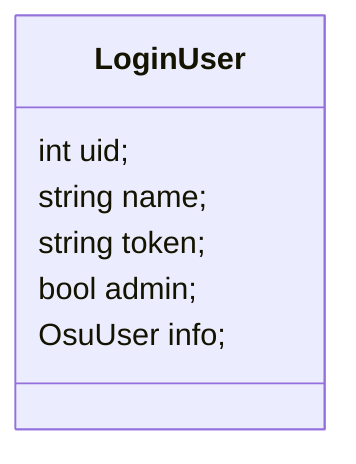

# 登陆接口

## 接口路径

`/api/user/login`

## 请求类型

- `GET`

## 请求参数

url 参数:

- `code` : 通过 osu 登陆后, 回调的获得的 code

## 响应结果

响应结果为单体数据, data定义为:


:::tip[引用]

- [`OsuUser`](../osu/01-user-info.md#响应结果) Osu User 信息

:::

```json
{
  "code": 200,
  "message": "登陆成功",
  "data": {
    "code": 200,
    "message": "ok",
    "data": {
      "uid": 17064371,
      "name": "-Spring Night-",
      "token": "<jwt token>",
      "admin": true,
      "info": {
        "id": 17064371,
        "name": "-Spring Night-",
        "avatar": "<url>",
        "cover": "<url>",
        "country": "TW",
        "fans": 445,
        "mode": "osu",
        "pp": 7082.6,
        "level": {
          "current": 102,
          "progress": 7
        },
        "global_rank": 26771,
        "country_rank": 437,
        "ranked_score": 69350041615,
        "total_score": 234701878517,
        "total_hits": 23188877
      }
    }
  }
}
```
