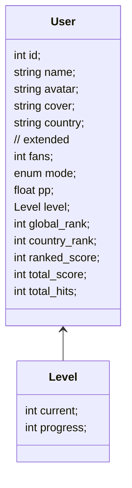

# 玩家信息

## 接口路径

`/api/osu/user/{uid|@name}`

## 请求类型

- `GET`

## 请求参数

path 参数:

- `uid` : 玩家的 user id, 必须是纯数字形式, 与 name 二选一
- `@name`: 玩家的用户名, 前面加上 `@` 符号, 与 uid 二选一

url 参数:

- `mode`: 游戏模式, 获取指定模式的 User 数据, 不填写默认为玩家主页模式
  可选值为 `osu`, `taiko`, `fruits`, `mania`, 可选

## 请求示例

```http request
GET /api/osu/user/2
```

```http request
GET /api/osu/user/@peppy
```

```http request
GET /api/osu/user/2?mode=mania
```

## 响应结果

data 定义为:



- 正常响应:
```json
{
  "code": 200,
  "message": "ok",
  "data": {
    "id": 2,
    "name": "peppy",
    "avatar": "https://a.ppy.sh/2?1657169614.png",
    "cover": "https://assets.ppy.sh/user-profile-covers/2/baba245ef60834b769694178f8f6d4f6166c5188c740de084656ad2b80f1eea7.jpeg",
    "country": "AU",
    "fans": 54674,
    "mode": "mania",
    "pp": 0,
    "level": {
      "current": 45,
      "progress": 5
    },
    "global_rank": 0,
    "country_rank": 0,
    "ranked_score": 372290000,
    "total_score": 600000660,
    "total_hits": 887232
  }
}
```

- 错误响应:

```json
{
  "code": 400,
  "message": "error message"
}
```
